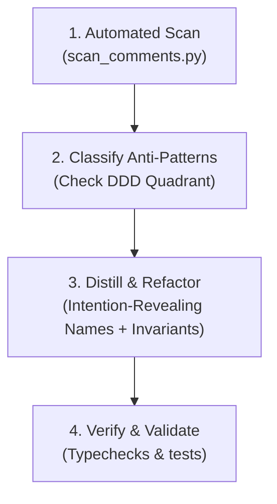

# Code-documentation simplification

Audit, simplify, and distill code comments and docstrings across polyglot source files. The objective is to eliminate vertical bloat, purge procedural step-by-step narration ("how" and "what"), and elevate high-signal statements of domain invariants, architectural constraints, and rationale ("why").

This skill operationalizes the design philosophy of **Eric Evans' *Domain-Driven Design: Tackling Complexity in the Heart of Software*** (specifically Chapter 2: *Documents and Diagrams* and Chapter 10: *Supple Design*).

---

## Foundational Principles (Eric Evans' *Domain-Driven Design*)

1. **The Code Is the Exact Behavioral Specification**:
   > *"First, a document shouldn’t try to do what the code already does well. The code already supplies the detail. It already is the ultimately exact specification of program behavior. It falls to other documents to illuminate meaning, to give insight into large-scale structures, and to focus attention on core elements."* (*DDD*, Chapter 2, p. 33)
   - Comments that merely walk through procedural steps duplicate the code, create cognitive drag, and inevitably drift.

2. **Intention-Revealing Interfaces Make Explanatory Comments Obsolete**:
   > *"Name classes and operations to describe their effect and purpose, without reference to the means by which they do what they promise. This relieves the client developer of the need to understand the internals... All the tricky mechanism should be encapsulated behind abstract interfaces that speak in terms of intentions, rather than means."* (*DDD*, Chapter 10, p. 172)
   - If an operation or parameter name expresses domain intent, delete the comment explaining how it works.

3. **Comments Belong as Assertions and Invariants**:
   > *"State post-conditions of operations and invariants of classes and aggregates. Make side effects explicit and make state boundaries predictable."* (*DDD*, Chapter 10, p. 179)
   - Preserve and prioritize comments that express non-obvious domain rules, mathematical invariants, hardware/OS quirks, or architectural seam boundaries (e.g. `// Invariant: ...`).

For complete textual analysis, read [references/domain-driven-design-principles.md](references/domain-driven-design-principles.md).

---

## The 4-Step Simplification Workflow



### Step 1: Scan Target Path for Comment Candidates

Execute the automated scanner over target directories or specific files:

```bash
# Full repository audit (summary view)
python3 "$SKILL_DIR/scripts/scan_comments.py" --format summary

# Detailed interactive report on specific target
python3 "$SKILL_DIR/scripts/scan_comments.py" --path src --min-lines 2

# Export machine-readable JSON for tooling
python3 "$SKILL_DIR/scripts/scan_comments.py" --path src --format json
```

Use `LOG_LEVEL` for controlling output verbosity:
```bash
LOG_LEVEL=debug python3 "$SKILL_DIR/scripts/scan_comments.py" --path src
```

### Step 2: Classify Findings Against the Comment Taxonomy

Evaluate each flagged block using the decision matrix:

| Finding | Detection Rule | Action |
|---|---|---|
| **Redundant Echo** | Docstring or comment echoes symbol name or parameter list. | **Delete**. Let the signature speak. |
| **Procedural Narration** | Step-by-step walkthrough (`first`, `then`, `we loop over`, `checks if`). | **Delete procedural text**. If intent is obscure, rename identifiers. |
| **Procedural with Invariant** | Procedural narrative surrounding an actual invariant or rule. | **Distill**. Extract the single invariant/rule line; delete the procedural noise. |
| **Apologetic Mask** | Long explanation justifying convoluted logic. | **Refactor**. Extract Intention-Revealing method or Value Object; condense comment to rationale. |
| **Seam Contract / Quirk** | Non-obvious FFI boundary, hardware quirk, or architectural boundary. | **Preserve and Distill**. Format as `// Invariant:` or `// Seam:`. |

Review detailed definitions in [references/comment-anti-patterns.md](references/comment-anti-patterns.md).

### Step 3: Apply Surgical Distillation & Refactoring

Transform the comment using these canonical rules:

1. **Purge the "How" and "What"**: Strip phrases explaining language control flow, variable assignments, loops, and conditions.
2. **Elevate the "Why"**:
   - Why does this constraint exist? (e.g. memory alignment, thread safety, license compliance).
   - What invariant must be preserved across state changes?
   - Which architectural seam is being enforced? (e.g. Layer 1 ontology, DuckDB telemetry minimization, BGFX drawable size).
3. **Use the Ubiquitous Language**: Replace informal descriptions with domain terms registered in `ontology/terms.toml` or architecture records (e.g., `catch`, `flow`, `telemetry_event`, `rights_flag`).
4. **Target 70–90% Line Count Reduction**: Multi-line essays should almost always collapse to 1 or 2 high-density lines, or zero if redundant.

Inspect polyglot before/after examples in [examples/transformations.md](examples/transformations.md).

### Step 4: Verification & Seam Validation

After modifying comments and refactoring symbols:

1. **Execute Language-Specific Compilers & Tests**:
   ```bash
   # Rust
   cargo check && cargo test

   # Python
   python3 "$SKILL_DIR/scripts/test_scan_comments.py"

   # TypeScript / Node
   npm test
   ```
2. **Ensure Zero AI Attribution**: Verify that no AI attribution tags (`Co-Authored-By`, `Generated-By`, or agent signatures) were introduced into comments, commits, or documentation.

---

## Comment Simplification Quick Reference Cheatsheet

```text
┌────────────────────────────────────────────────────────┐
│               THE 4 COMMENT QUESTIONS                  │
├────────────────────────────────────────────────────────┤
│ 1. Does the code already say this?                     │
│    YES ──> DELETE THE COMMENT.                         │
│                                                        │
│ 2. Can the code say this with a better name or type?   │
│    YES ──> RENAME IDENTIFIER / TYPE AND DELETE COMMENT.│
│                                                        │
│ 3. Does this narrate procedural steps (first, then...)?│
│    YES ──> STRIP PROCEDURAL NARRATIVE.                 │
│                                                        │
│ 4. Does this inform a domain invariant, seam contract, │
│    hardware constraint, or architectural rationale?   │
│    YES ──> DISTILL TO A SINGLE HIGH-DENSITY INVARIANT. │
└────────────────────────────────────────────────────────┘
```
